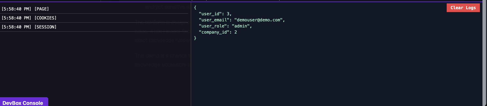
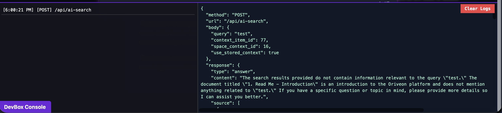

# DevBox Utility Console

A lightweight in-browser developer console that logs form submissions, API requests, cookies, session data, and more — without needing to open browser dev tools.

---

## 🚀 Features
- Toggleable console at the bottom of any webpage  
- Form submissions logged with full field data (intercepted before sending)  
- Fetch/XHR requests captured with method, URL, body, and parsed response  
- Session, cookies, and page info automatically logged on load  
- Persistent logs stored in `localStorage` (survive reloads)  
- Sidebar navigation with timestamped events  
- Main panel to inspect JSON/object details  
- Clear Logs button and `localStorage` reset  
- Keyboard shortcut: `Ctrl/⌘ + \`` to toggle visibility  

---

## 🛠 Installation
Add the script at the bottom of your HTML page:

```html
<script src="devbox.js"></script>

Or inject dynamically (bookmarklet, extension, console paste).

⸻

📖 Usage

Once loaded, a purple DevBox Console tab appears in the bottom left:
	•	Click the tab (or press `Ctrl/⌘ + ``) to open/close the console
	•	Use the sidebar to select an event and inspect details in the main panel
	•	Click Clear Logs to reset the sidebar, main view, and localStorage

⸻

🔑 API

Available under window.DevBox:

DevBox.open()        // Show console
DevBox.close()       // Hide console
DevBox.toggle()      // Toggle visibility
DevBox.isOpen()      // Returns true/false
DevBox.clear()       // Clears logs + localStorage
DevBox.setBlockRedirects(true) // (Future) Prevent redirects


⸻

⚡ Optional PHP Integration

To also log server-side context (session, GET/POST variables, current file), inject this snippet in your PHP templates:

<?php
echo '<script>\n';
echo 'window.__DEVBOX_SESSION = ' . json_encode($_SESSION ?? []) . ';\n';
echo 'window.__DEVBOX_GET = ' . json_encode($_GET ?? []) . ';\n';
echo 'window.__DEVBOX_POST = ' . json_encode($_POST ?? []) . ';\n';
echo 'window.__DEVBOX_FILE = ' . json_encode($_SERVER["REQUEST_URI"] ?? "") . ';\n';
echo '</script>\n';
?>

This will make the variables available to DevBox in the browser console.
They will then appear as additional log entries:
	•	[SESSION] – Current PHP session variables
	•	[GET] – Query string parameters
	•	[POST] – Posted form data
	•	[FILE] – Current request URI

⸻

⚠️ Notes
	•	Intended for debugging only — don’t use in production without security
	•	Captured data (forms, cookies, API responses, sessions) may include sensitive information

⸻

📩 Contact

Created by weareprismic.com
Email: jason@weareprismic.com

⸻

📌 Variables
	•	visible – Tracks whether the console is open/closed
	•	blockRedirects – Future option to block page redirects
	•	stopSubmit – Controls whether form submissions are intercepted
	•	logEntries – Stores captured logs in memory + localStorage
	•	devBox, sidebar, mainView – Core UI elements
	•	origFetch – Wrapped native fetch for request/response logging
	•	__DEVBOX_SESSION, __DEVBOX_GET, __DEVBOX_POST, __DEVBOX_FILE – Optional server-side context (PHP integration)

```


